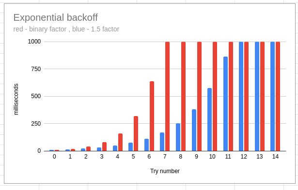

# java-functional-addons


[JavaDocs](https://skopylov58.github.io/java-functional-addons/)

## `Try<T>` - functional exception handling

### Rational behind `Try<T>`

I really like Java's functional features (streams, optionals, etc.) very much but it becomes painful 
when using them in the real context. That is because Java's functional interfaces are Exception unaware
and you must handle checked exceptions inside lambdas.
Lets look at simple procedure of converting list of strings to list of URLs.

```java
    private List<URL> urlListTraditional(String[] urls) {
        return Stream.of(urls)
        .map(s -> {
            try {
                return new URL(s);
            } catch (MalformedURLException me) { // Ops..., not too pretty
                return null;
            }
        }).filter(Objects::nonNull)
          .collect(Collectors.toList());
    }
```

`Try<T>` presents computation that may produce success result of type T or failure with exception.
It is quite similar to Java `Optional<T>` which may have result value of type T or nothing (null value).
With `Try<T>`, sample above will look like this:

```java
    private List<URL> urlListWithTry(String[] urls) {
        return Stream.of(urls)
            .map(Try.of(URL::new))
            .flatMap(Try::stream) //Failure gives empty stream
            .collect(Collectors.toList());
    }
```
### `Try<T>` with `Stream<T>` and `Optional<T>`

`Try<T>` can be easily converted  to the `Optional<T>` by using `Try#optional()` such way that failed Try will be converted to the `Optional.empty`.

I have intentionally made `Try<T>` API very similar to the Java `Optional<T>` API.
`Try#filter(Predicate<T>)` and`Try#map(Function<T,R>)` methods have the same semantics as corresponding Optional methods.
So if you are familiar to `Optional<T>` then you will get used to `Try<T>` with easy.

`Try<T>` can be easily converted  to the `Stream<T>` by using `Try#stream()` the same way as it is done for `Optional#stream()`.
Successful `Try<T>` will be converted to one element stream of type T, failed Try will be converted to the empty stream.

You can filter failed tries in the stream two possible ways - first is traditional by using `Try#filter()`

```
    ...
    .filter(Try::isSuccess)
    .map(Try::get)
    ...

```

Second approach is a bit shorter by using `Try#stream()`

```
    ...
    .flatMap(Try::stream)
    ...
```

This code will filter failed tries and return stream of successful values of type T.

### Recovering failed `Try<T>`

Do you have plans to recover from failures? If yes then `Try<T>` will help you to recover with easy.
You can chain as many recover strategies as you want.

```java
Try.of(...)
  .map(...)
  .map(...)
  .filter(...)
  .recover(recoverPlanA)
  .recover(recoverPlanB)
  .recover(recoverPlanC)
  .onSuccess(...)
  .orElse(...)
```

If planA succeeds then PlanB and PlanC will not have effect (will not be invoked). Explanation is 
simple - recover procedure has no effect for successful Try, so the only the first successful
plan will be in action.

### `Try<T>` with resources

`Try<T>` implements AutoCloseable interface, and `Try<T>` can be used inside `try-with-resource` block. 
Let's imagine we need open socket, write a few bytes to the socket's output stream and then close socket.
This code with `Try<T>` will look as following:

```
    try (var s = Try.of(() -> new Socket("host", 8888))) {
        s.map(Socket::getOutputStream)
        .onSuccess(out -> out.write(new byte[] {1,2,3}))
        .onFailure(e -> System.out.println(e));
    }
```

Socket will be closed after last curly bracket.

## `Retry<T>` - asynchronous functional retry procedure

Retry is ancient strategy of failure recovering. We using Retry a lot when connecting to databases, doing HTTP requests, sending e-mails, etc., etc.
Naive retry implementations typically do retries in the loop and sleeping some time when exceptions occur. The main disadvantage ot this approach is that `Thread.sleep(...)` is blocking synchronous operation that freezes working thread.

`Retry<T>` is compact single Java class utility without external dependencies to perform asynchronous retry procedure on given `Supplier<T>` or `Runnable` using CompletableFutures.

Minimalistic sample usage with default retry settings is as following:

```java
CompletableFuture<Connection> futureConnection = 
Retry.of(() -> DriverManager.getConnection("jdbc:mysql:a:b"))
.retry();
```
This code will retry `getConnection(...)` 10 times with fixed delay 100 milliseconds using `ForkJoinPool.commonPool()`. You can specify any other executor for your retry process by using `Retry#withExecutor(...)` method.

Retry behavior is controlled by user supplied backoff function.
In terms of functional programming, backoff function is a `BiFunction<Long,Throwable,Duration>` which maps current try number (starting with 0) and caught exception to the duration to wait until next try will happen. If backoff function returns null, that is signal to stop retrying process.

Don't be afraid, it's simple. Backoff function below always return 50 millisecond 
which mean forever retry process with fixed 50 millisecond delay.

```java
CompletableFuture<Connection> futureConnection = 
Retry.of(() -> DriverManager.getConnection("jdbc:mysql:a:b"))
.withBackoff((i,th) -> Duration.ofMillis(50))
.retry();
```

Next sample shows retry process with 100 maximum number of tries and fixed delay

```java
CompletableFuture<Connection> futureConnection = 
Retry.of(() -> DriverManager.getConnection("jdbc:mysql:a:b"))
.withBackoff((i,th) -> i < 100 ? Duration.ofMillis(50) : null)
.retry();
```

Next sample shows retrying only on IOException
```java
CompletableFuture<Connection> futureConnection = 
Retry.of(() -> DriverManager.getConnection("jdbc:mysql:a:b"))
.withBackoff((i,th) -> th instanceof IOException ? Duration.ofMillis(50) : null)
.retry();
```

The fact, that backoff function takes current try number as parameter, give us an ability to implement popular exponential backoff retry strategies. The formula for exponential backoff is the following:

delay<sub>i</sub> = min * base<sup>i</sup> 

where i=0,1,2,3...is current try number, min - initial delay.
Case when base = 2 is known as binary exponential backoff which will increase delay twice on each retry.

You can easily implement any desired backoff strategy. Anyway, `Retry<T>` offers out of box six higher-order functions to create common used backoff functions.

```java
    static BiFunction<Long, Throwable, Duration> maxRetriesWithFixedDelay(long maxRetries, Duration delay) {
        return (i, th) -> i < maxRetries ? delay : null;
    }

    static BiFunction<Long, Throwable, Duration> maxRetriesWithExponentialDelay(long maxRetries, Duration min, Duration max, double factor) {
        return (i, th) -> i < maxRetries ? exponentialBackoff(i, min, max, factor) : null;
    }

    static BiFunction<Long, Throwable, Duration> maxRetriesWithBinaryExponentialDelay(long maxRetries, Duration min, Duration max) {
        return (i, th) -> i < maxRetries ? exponentialBackoff(i, min, max, 2) : null;
    }
    
    static BiFunction<Long, Throwable, Duration> foreverWithFixedDelay(Duration delay) {
        return (i, th) -> delay;
    }

    static BiFunction<Long, Throwable, Duration> foreverWithExponentialDelay(Duration min, Duration max, double factor) {
        return (i, th) -> exponentialBackoff(i, min, max, factor);
    }

    static BiFunction<Long, Throwable, Duration> foreverWithBinaryExponentialDelay(Duration min, Duration max) {
        return (i, th) -> exponentialBackoff(i, min, max, 2);
    }
```

The sample with binary exponential backoff, initial delay 10 milliseconds, maximum 1 second.

```java
CompletableFuture<Connection> futureConnection = 
Retry.of(() -> DriverManager.getConnection("jdbc:mysql:a:b"))
.withBackoff(Retry.maxRetriesWithBinaryExponentialDelay(16, Duration.ofMillis(10), Duration.ofSeconds(1)))
.retry();
```



## JDBC proxy driver (JDBCMiddleman)

### What for?

JDBCMiddleman driver can be used for:

- performance benchmarking of your JDBC code
- looking what really happens under the hood
- troubleshooting your code
- simulating network latencies
- discovering uncaught exceptions
- intercepting any JDBC call with your custom interceptors
- inspecting 3-rd party JDBC code

### How to use

1. Put this driver into your's application class-path.
2. Prepend your's DB URL with "jdbc:middleman:" prefix, for example "jdbc:middleman:jdbc:mysql://localhost:3306/foo"
3. Done
4. Run your application and observe info in the standard output.

### Custom interceptors

JDBCMiddleman driver is shipped with default `SimpleLoggingInterceptor` which logs to the standard output JDBC invocations and corresponding results with nanoseconds precision:

```
Invoke: prepareStatement with params [INSERT INTO NAMES (name, age) VALUES (?, ?)]
Result prep0: INSERT INTO NAMES (name, age) VALUES (?, ?) took PT0.0019989S
Invoke: setString with params [1, John]
Result null took PT0S
Invoke: setInt with params [2, 40]
Result null took PT0.0010007S
Invoke: executeUpdate with params null
Result 1 took PT0.0019985S
Invoke: executeQuery with params [SELECT * from NAMES]
Result rs3: org.h2.result.LocalResult@543588e6 columns: 2 rows: 1 pos: -1 took PT0.0130346S
Invoke: next with params null
Result true took PT0S
Invoke: getString with params [1]
Result John took PT0S
Invoke: getInt with params [2]
Result 40 took PT0S
John 40
```

You may create your own interceptor by implementing 
[jdbc.Interceptor](jdbc/src/main/java/com/github/skopylov58/jdbc/Interceptor.java) interface.
To bring your interceptor into action, please:

- put your's interceptor into application class-path 
- specify system property `jdbc.interceptor` with your's interceptor full class name


## Simple JDBC connection pool

  

